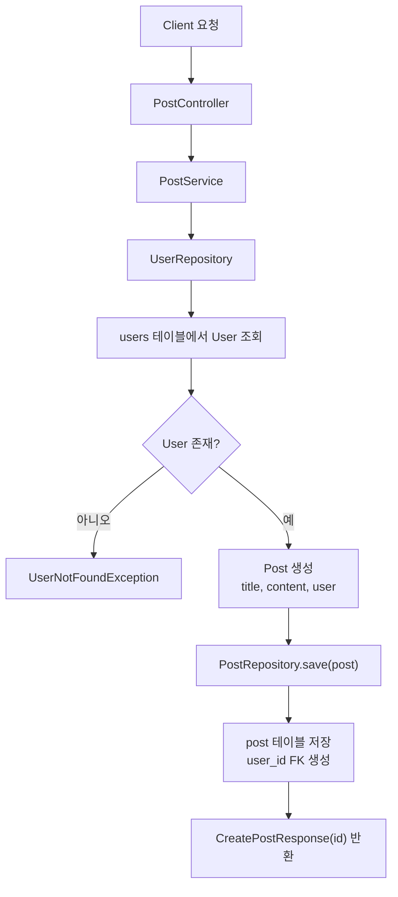
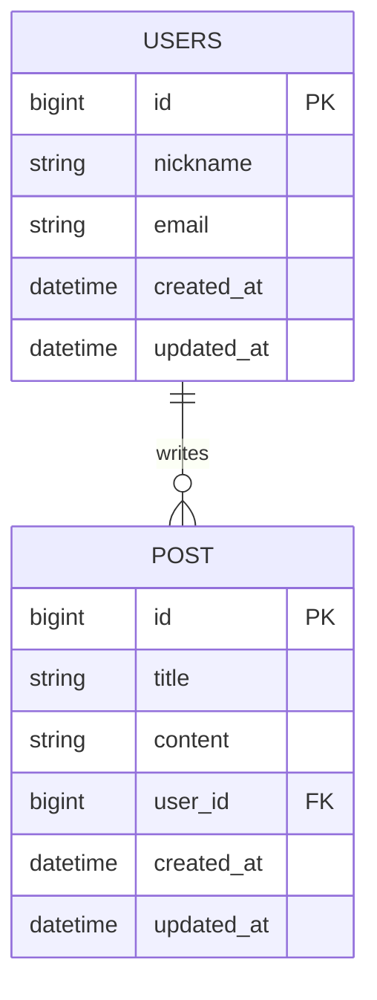
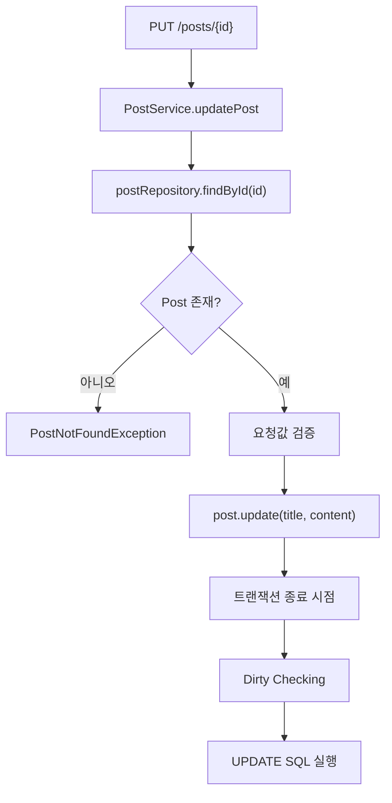

# 3차 세미나 실습 구현 정리

## 개요

13번 브랜치에서는 기존 인메모리 기반 게시글 저장 구조를 JPA와 H2 데이터베이스 기반 구조로 전환하고, 게시글과 사용자 사이의 연관관계를 추가했다.

핵심 변화는 다음과 같다.

- `Post`를 JPA 엔티티로 전환
- `PostRepository`를 `JpaRepository` 기반으로 전환
- `User` 엔티티와 `UserRepository` 추가
- `Post`와 `User`를 다대일 관계로 연결
- 게시글 생성 시 `author` 문자열 대신 `userId`로 작성자 조회
- 생성일과 수정일을 `BaseTimeEntity`와 JPA Auditing으로 자동 관리
- JPA 변경 감지를 위해 Service 계층에 `@Transactional` 적용

## 전체 구조 변화

기존 구조에서는 `PostRepository`가 `ArrayList`를 직접 관리하고, `PostService`가 게시글 id와 생성 시간을 직접 만들었다.

변경 후에는 `PostRepository`와 `UserRepository`가 Spring Data JPA를 통해 DB 접근을 담당한다. `PostService`는 요청으로 받은 `userId`를 이용해 `User`를 조회하고, 조회된 `User`를 `Post`에 연결한 뒤 저장한다.



## DB 및 JPA 설정

`build.gradle`에 JPA와 H2 의존성을 추가했다.

```groovy
implementation 'org.springframework.boot:spring-boot-starter-data-jpa'
runtimeOnly 'com.h2database:h2'
```

`application.yml`에는 H2 인메모리 DB와 JPA 설정을 추가했다.

```yaml
spring:
  datasource:
    url: jdbc:h2:mem:testdb
    driver-class-name: org.h2.Driver
    username: sa
    password:

  h2:
    console:
      enabled: true

  jpa:
    hibernate:
      ddl-auto: create
    show-sql: true
```

이 설정을 통해 애플리케이션 실행 시 엔티티 기준으로 테이블이 생성되고, JPA가 실행하는 SQL을 콘솔에서 확인할 수 있다.

## BaseTimeEntity와 Auditing

공통 시간 필드는 `BaseTimeEntity`로 분리했다.

```java
@MappedSuperclass
@EntityListeners(AuditingEntityListener.class)
public abstract class BaseTimeEntity {

    @CreatedDate
    private LocalDateTime createdAt;

    @LastModifiedDate
    private LocalDateTime updatedAt;
}
```

`@MappedSuperclass`를 사용했기 때문에 `BaseTimeEntity` 자체는 테이블로 생성되지 않고, 이를 상속한 엔티티의 컬럼으로 `created_at`, `updated_at`이 포함된다.

Auditing 기능을 활성화하기 위해 `JpaAuditingConfig`를 추가했다.

```java
@Configuration
@EnableJpaAuditing
public class JpaAuditingConfig {
}
```

## 엔티티 전환

### User 엔티티

`User`는 사용자 정보를 표현하는 엔티티다.

```java
@Entity
@Table(name = "users")
public class User extends BaseTimeEntity {
    @Id
    @GeneratedValue(strategy = GenerationType.IDENTITY)
    private Long id;

    private String nickname;
    private String email;
}
```

테이블명은 `user` 대신 `users`로 지정했다. 일부 DB에서 `user`가 예약어처럼 취급될 수 있기 때문이다.

### Post 엔티티

`Post`는 JPA 엔티티로 전환되었고, `User`와 다대일 관계를 맺는다.

```java
@Entity
public class Post extends BaseTimeEntity {
    @Id
    @GeneratedValue(strategy = GenerationType.IDENTITY)
    private Long id;

    private String title;
    private String content;

    @ManyToOne(fetch = FetchType.LAZY)
    @JoinColumn(name = "user_id")
    private User user;
}
```

`@ManyToOne(fetch = FetchType.LAZY)`는 여러 게시글이 한 명의 사용자에게 속할 수 있음을 표현한다.

`@JoinColumn(name = "user_id")`를 통해 `post` 테이블에 `user_id` 외래 키 컬럼이 생성된다.



## Repository 전환

기존 `PostRepository`는 직접 `ArrayList`를 들고 게시글을 저장했다. JPA 전환 후에는 `JpaRepository`를 상속하는 인터페이스로 변경했다.

```java
public interface PostRepository extends JpaRepository<Post, Long> {
}
```

`UserRepository`도 추가했다.

```java
public interface UserRepository extends JpaRepository<User, Long> {
}
```

이제 `save`, `findAll`, `findById`, `deleteById` 같은 기본 DB 작업은 Spring Data JPA가 제공한다.

## 요청과 응답 DTO 변경

게시글 생성 요청은 더 이상 작성자를 문자열로 받지 않는다. 대신 `userId`를 받아 실제 `User` 엔티티를 조회한다.

```java
public class CreatePostRequest {
    private String title;
    private String content;
    private Long userId;
}
```

게시글 응답에서는 `Post`에 연결된 `User`의 닉네임을 작성자 정보로 내려준다.

```java
this.author = post.getUser().getNickname();
```

## PostService 전환

`PostService`는 `PostRepository`와 함께 `UserRepository`를 주입받는다.

게시글 생성 흐름은 다음과 같다.

1. 요청값의 제목과 내용을 검증한다.
2. `request.getUserId()`로 `User`를 조회한다.
3. `User`가 없으면 `UserNotFoundException`을 발생시킨다.
4. 조회한 `User`를 사용해 `Post`를 생성한다.
5. `postRepository.save(post)`로 DB에 저장한다.
6. 저장된 게시글 id를 응답한다.

```java
User user = userRepository.findById(request.getUserId())
        .orElseThrow(UserNotFoundException::new);

Post post = new Post(
        request.getTitle(),
        request.getContent(),
        user
);

Post savedPost = postRepository.save(post);
return new CreatePostResponse(savedPost.getId());
```

## 트랜잭션 적용

Service 계층에는 작업 성격에 따라 `@Transactional`을 적용했다.

- 생성, 수정, 삭제: `@Transactional`
- 조회: `@Transactional(readOnly = true)`

특히 수정 API는 엔티티 필드만 변경하고 별도로 `save`를 호출하지 않는다.

```java
post.update(request.getTitle(), request.getContent());
```

이 변경이 DB에 반영되려면 트랜잭션 안에서 JPA의 변경 감지가 동작해야 한다.



## 예외 처리

사용자를 찾지 못한 경우를 처리하기 위해 `UserNotFoundException`을 추가했다.

```java
public class UserNotFoundException extends RuntimeException {
    private final ErrorCode errorCode;

    public UserNotFoundException() {
        super(ErrorCode.USER_NOT_FOUND.getMessage());
        this.errorCode = ErrorCode.USER_NOT_FOUND;
    }
}
```

`ErrorCode`에는 사용자 미조회 에러가 추가되었다.

```java
USER_NOT_FOUND(HttpStatus.NOT_FOUND, "USER_001", "사용자를 찾을 수 없습니다.")
```

`GlobalExceptionHandler`에서 해당 예외를 잡아 공통 실패 응답으로 변환한다.

## 최종 요청 흐름

게시글 생성 요청 예시는 다음과 같다.

```json
{
  "title": "오늘 학식 뭐임",
  "content": "돈까스래",
  "userId": 1
}
```

성공 시 응답은 생성된 게시글 id를 반환한다.

```json
{
  "success": true,
  "code": "SUCCESS",
  "message": "게시글 등록 완료",
  "data": {
    "id": 1
  }
}
```

존재하지 않는 사용자 id로 요청하면 다음과 같은 실패 응답을 반환한다.

```json
{
  "success": false,
  "code": "USER_001",
  "message": "사용자를 찾을 수 없습니다.",
  "data": null
}
```

## 정리

이번 구현을 통해 게시글 저장 방식은 인메모리 컬렉션에서 실제 DB 기반 저장으로 전환되었다. 또한 게시글이 작성자 문자열을 직접 가지는 대신, `User` 엔티티와 외래 키로 연결되도록 구조가 변경되었다.

이제 게시글은 DB에 저장되고, 작성자 정보는 `users` 테이블과 `post.user_id` 관계를 통해 관리된다.
