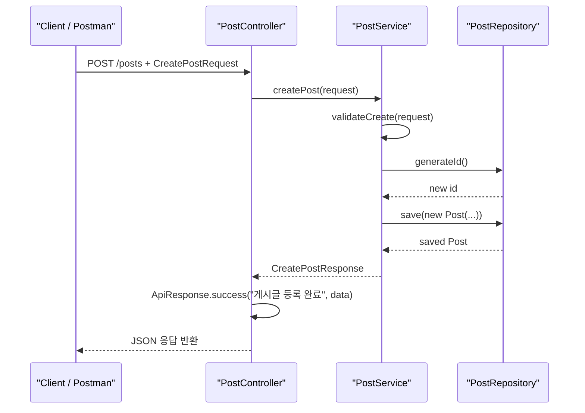
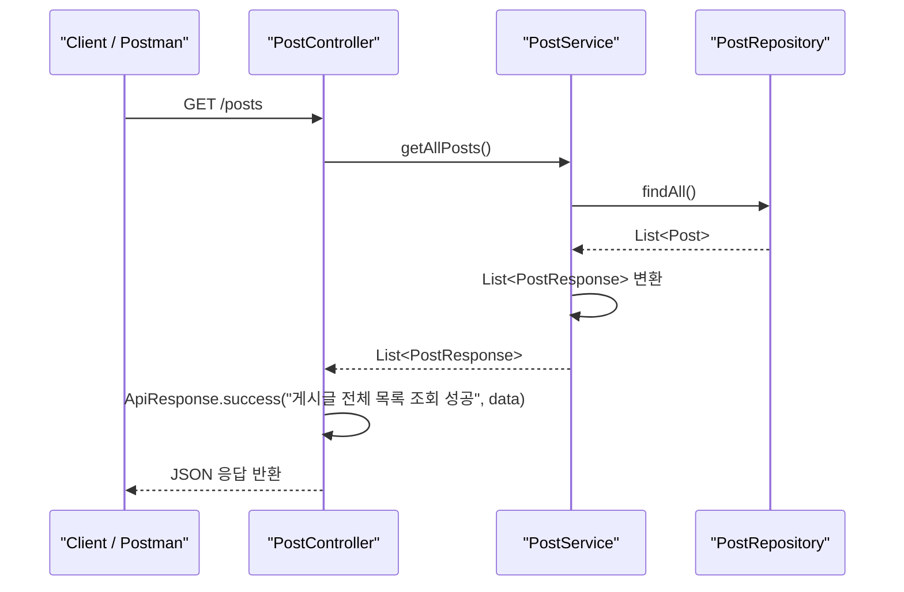
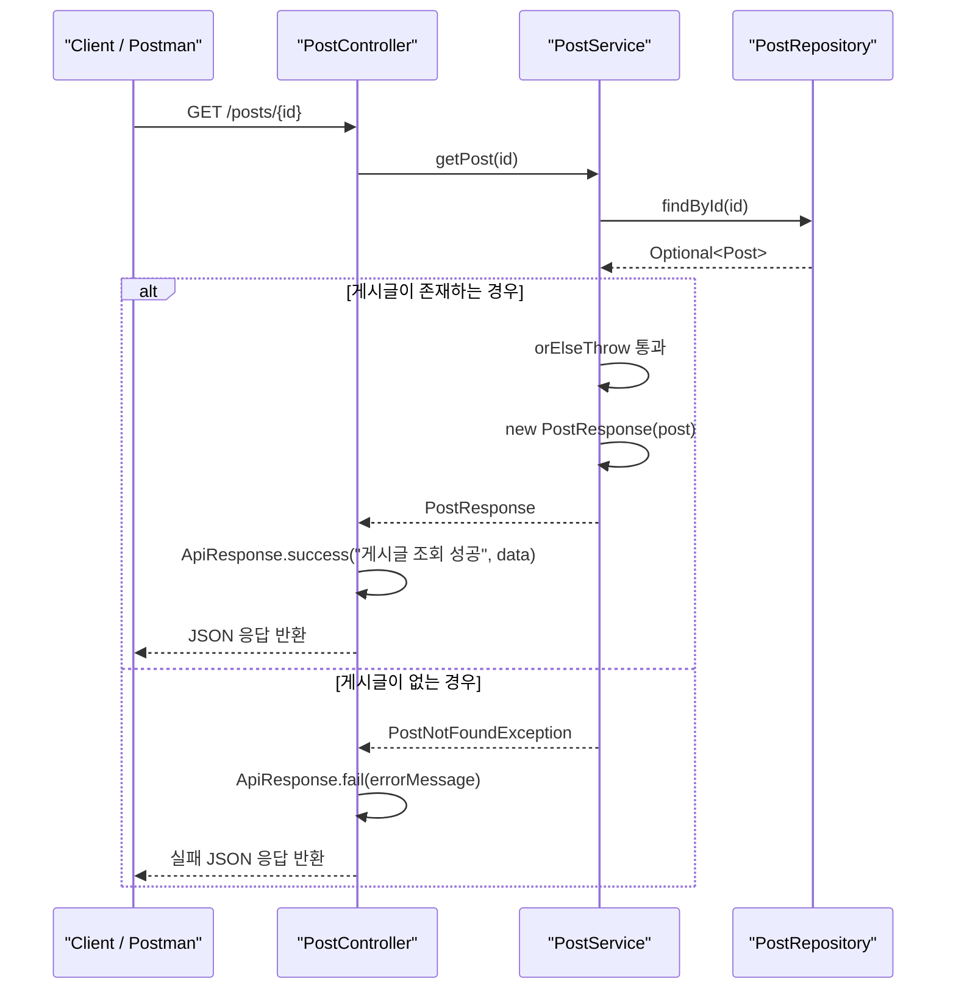
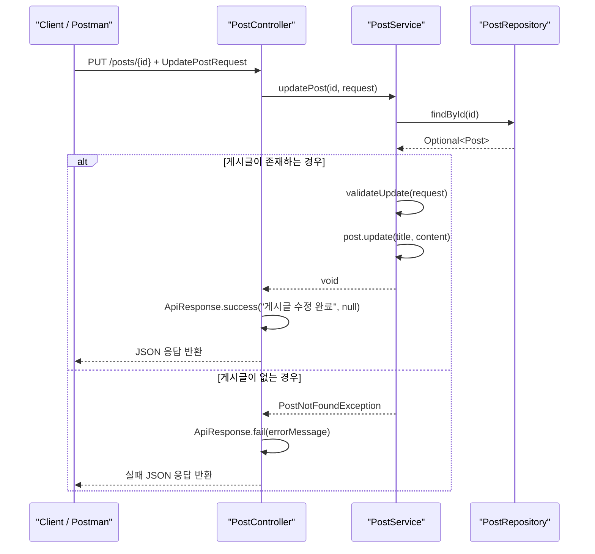
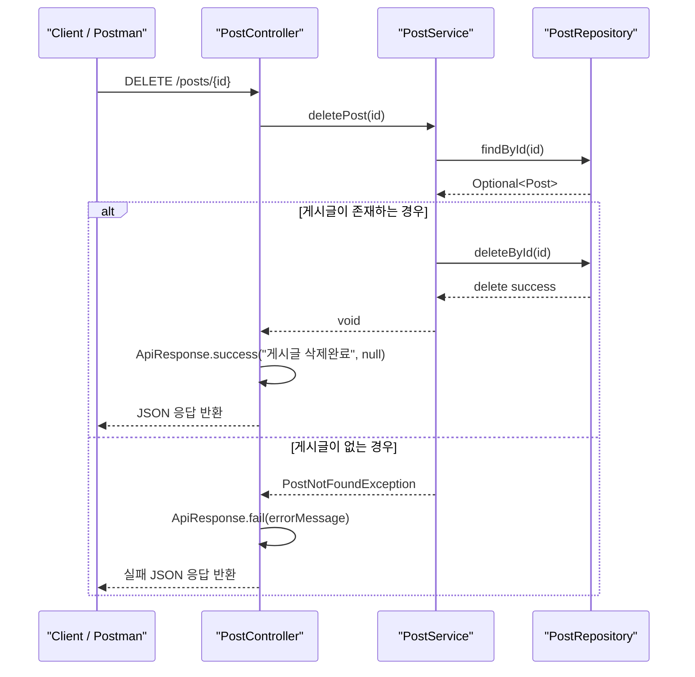

# 2차 세미나 REST API 전환 정리

## 1. 문서 목적

이번 브랜치에서 진행한 Spring REST API 전환 작업을 한 번에 정리한다.  
기존 콘솔 입력 기반 게시글 프로그램을 Spring Boot 기반 웹 애플리케이션으로 옮기면서 바뀐 구조, 엔드포인트별 요청 흐름, 그리고 Swagger 연동 과정까지 함께 기록한다.

## 2. 이번 브랜치에서 개선한 내용

### 1) 애플리케이션 진입점 전환

- `Main.java`를 `@SpringBootApplication` 기반 진입점으로 변경했다.
- `SpringApplication.run(Main.class, args)`를 사용해 내장 서버가 실행되도록 전환했다.
- 기존 콘솔 입력 방식은 더 이상 메인 진입 흐름에서 사용하지 않는다.

### 2) Controller를 REST API 구조로 전환

- `PostController`에 `@RestController`와 `@RequestMapping("/posts")`를 적용했다.
- HTTP 메서드별로 아래 매핑을 추가했다.
  - `POST /posts`
  - `GET /posts`
  - `GET /posts/{id}`
  - `PUT /posts/{id}`
  - `DELETE /posts/{id}`
- 요청 본문은 `@RequestBody`로 받고, 경로 변수는 `@PathVariable`로 받도록 변경했다.

### 3) Service / Repository를 Spring Bean 구조로 정리

- `PostService`에 `@Service`를 적용했다.
- `PostRepository`에 `@Repository`를 적용했다.
- `new`로 직접 객체를 생성하던 구조를 생성자 주입 방식으로 바꿨다.

### 4) 공통 응답 포맷 정리

- 기존 `CommonResponse`를 `ApiResponse`로 리네이밍했다.
- 모든 API 응답을 아래 구조로 통일했다.

```json
{
  "success": true,
  "message": "게시글 조회 성공",
  "data": {}
}
```

### 5) `Optional` 기반 조회 처리 적용

- `PostRepository.findById()`의 반환형을 `Post`에서 `Optional<Post>`로 변경했다.
- `PostService`에서는 `orElseThrow(() -> new PostNotFoundException(id))` 패턴으로 조회 실패를 처리하도록 정리했다.

## 3. 현재 API 엔드포인트 요약

| 기능 | Method | URL | Request Body |
| --- | --- | --- | --- |
| 게시글 생성 | `POST` | `/posts` | `CreatePostRequest` |
| 게시글 전체 조회 | `GET` | `/posts` | 없음 |
| 게시글 단건 조회 | `GET` | `/posts/{id}` | 없음 |
| 게시글 수정 | `PUT` | `/posts/{id}` | `UpdatePostRequest` |
| 게시글 삭제 | `DELETE` | `/posts/{id}` | 없음 |

## 4. 엔드포인트별 시퀀스 다이어그램

### 4.1 게시글 생성



예시 요청 본문:

```json
{
  "title": "첫 게시글",
  "content": "내용입니다.",
  "author": "jaehunshin"
}
```

### 4.2 게시글 전체 조회



### 4.3 게시글 단건 조회



### 4.4 게시글 수정



예시 요청 본문:

```json
{
  "title": "수정된 제목",
  "content": "수정된 내용"
}
```

### 4.5 게시글 삭제



## 5. Postman 확인 시 주의한 점

- 엔드포인트는 trailing slash 없이 사용하는 것을 기준으로 정리했다.
  - 예: `/posts`, `/posts/1`
- `POST`, `PUT` 요청은 `Body -> raw -> JSON`으로 보내야 한다.
- `form-data`로 보내면 `@RequestBody`와 맞지 않아 `415 Unsupported Media Type`이 발생한다.
- `baseUrl` 변수 끝에 `/`를 넣고 요청 URL에도 `/posts`를 붙이면 `//posts`가 되어 `404`가 날 수 있으므로 주의한다.

## 6. Swagger 추가 및 버전 조정 내용

### 1) `build.gradle`에 Swagger UI 의존성 추가

Spring Boot 애플리케이션에서 API 명세를 웹으로 확인하기 위해 아래 의존성을 추가했다.

```gradle
implementation 'org.springdoc:springdoc-openapi-starter-webmvc-ui:2.5.0'
```

추가 후 확인 가능한 경로는 아래와 같다.

- `/swagger-ui.html`
- `/v3/api-docs`

### 2) 처음 시도한 버전과 문제

처음에는 `2.8.17` 버전을 추가했지만, 현재 프로젝트의 Spring Boot 버전은 `3.2.4`이기 때문에 실행 시 호환성 문제가 발생했다.

대표적으로 아래와 같은 예외가 확인됐다.

```text
NoClassDefFoundError: org/springframework/web/servlet/resource/LiteWebJarsResourceResolver
```

즉, Swagger 기능 자체의 문제라기보다 `springdoc` 버전과 Spring Boot 버전 조합이 맞지 않았던 것이다.

### 3) 버전을 낮춘 이유

현재 프로젝트는 아래 버전을 사용한다.

- `org.springframework.boot` `3.2.4`
- `io.spring.dependency-management` `1.1.4`

이 조합에서는 `springdoc-openapi 2.5.x` 대가 더 안정적으로 맞기 때문에, `2.8.17`에서 `2.5.0`으로 낮췄다.

정리하면:

- 처음 추가: `2.8.17`
- 최종 반영: `2.5.0`
- 목적: 현재 Spring Boot 3.2.4와의 호환성 확보

## 7. 최종 정리

이번 브랜치에서는 게시글 프로그램을 콘솔 앱에서 Spring Boot REST API 구조로 전환했다.  
그 과정에서 `Controller - Service - Repository` 계층을 Spring Bean 구조로 정리했고, `ApiResponse` 기반 공통 응답 포맷을 적용했으며, Postman으로 CRUD 동작을 확인했다.

추가로 Swagger UI를 도입해 API 명세를 브라우저에서 확인할 수 있도록 했고, 현재 Spring Boot 버전에 맞추기 위해 `springdoc-openapi` 버전을 낮춰 안정적으로 실행되도록 정리했다.
